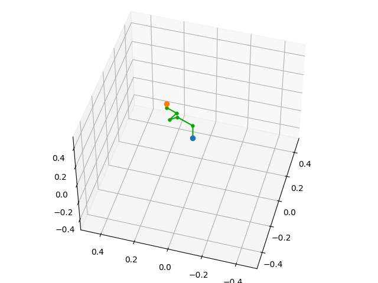
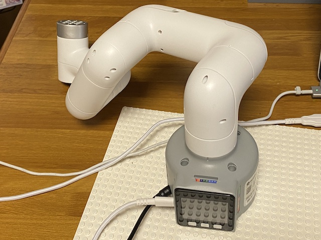

# mycobot_pi
Python script of myCobot





## Dependency

- Python3
- macOS / Linux
- Numpy
- Matplotlib
- myCobot Atom version 2.7
- pymycobot==2.3.3

## Setup

Execute following commands:

```sh
$ pip3 install numpy
$ pip3 install matplotlib
$ pip3 install pymycobot==2.1.2
$ git clone https://github.com/karaage0703/mycobot_pi
$ cd mycobot_pi
```

## Usage

### Simulator

```python
$ python3 -i mycobot_sim.py
>>> mycobot_sim.inverse_kinematics([0.15, 0.2, 0.1, 0, 0, 0], plot=True)
>>> mycobot_sim.send_angles(mycobot_sim.convert_joint_angles_sim_to_mycobot([0.0, 0.0, 0.0, 0.0, 0.0, 0.0]))
>>> mycobot_sim.forward_kinematics(plot=True)
```


### Real Robot

```python
$ python3 -i mycobot_real.py
>>> move_initial_pose(speed=50)
>>> draw_robot()
>>> joint_angles = calc_ik([0.15, 0.2, 0.1, 0, 0, 0], plot=True)
>>> move_robot(speed=50)
>>> move_initial_pose()
>>> move_robot(speed=80)
>>> move_initial_pose(speed=80)
```

## License

This software is released under the MIT License, see LICENSE.

## References

- https://github.com/elephantrobotics/myCobot
- https://github.com/AtsushiSakai/PythonRobotics
